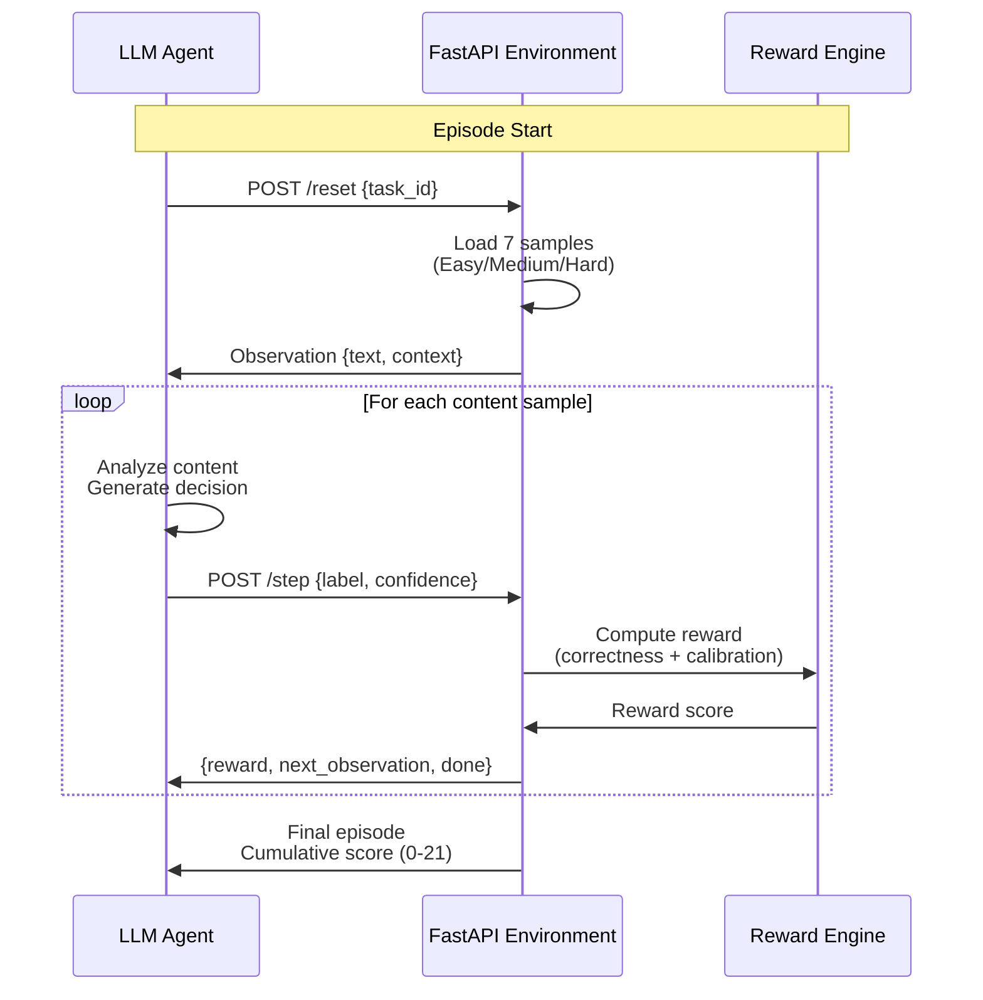

# TrustMod: Content Moderation OpenEnv

[](https://www.python.org/downloads/release/python-3110/)
[](https://fastapi.tiangolo.com/)
[](https://www.docker.com/)
[](https://huggingface.co/spaces)
[](https://github.com/openenv/openenv)

**Bridging AI and Computational Social Science**: An intelligent content moderation environment where agents learn to classify user-generated content and protect digital communities at scale.

## The Problem: Why Content Moderation?

Every second, over 500 hours of video content is uploaded to YouTube alone. Across Meta's platforms, X (Twitter), TikTok, and Reddit, billions of pieces of content are created daily. Human moderation alone cannot scale. Trained moderators can review maybe a few hundred pieces per day, but the volume dwarfs human capacity. This creates a dangerous gap: harmful content from hate speech to violence incitement to exploitation spreads far faster than it gets removed.

Content moderation sits at the intersection of computer science and Computational Social Science (CSS). CSS explores how computational systems shape human behavior online, influence information spread, and affect collective outcomes. A well-trained AI moderation agent does more than flag spam. It breaks radicalization pipelines, shields vulnerable communities, preserves psychological safety in communities, and scales platform values across billions of users. For Meta and similar platforms, protecting people from harmful content isn't just business strategy. It's a core ethical responsibility. Billions of people rely on these systems working 24/7 across dozens of languages and cultural contexts.

This environment simulates the exact decision-making pipeline that production moderation systems use: receive content in context, classify it, assign confidence, compute feedback, and improve. By building agents that excel in this domain, we contribute to safer digital ecosystems and demonstrate that AI can be a force for social good when applied thoughtfully to meaningful problems.

## What This Environment Does

Content Moderation OpenEnv provides a reinforcement learning setting where AI agents learn to classify user-generated content across five categories (safe, spam, hate_speech, violence, adult_content) under varying difficulty levels. Agents observe content text and platform context, submit moderation decisions with confidence scores, and receive rewards based on correctness and calibration. The agent loop repeats over ten samples per task, three difficulty tiers per episode, with cumulative scoring encouraging both accuracy and responsible uncertainty quantification. The system includes **experience replay** that persists across runs, enabling continuous improvement through memory of past mistakes.



## Task Design

Each task presents content samples of increasing complexity, testing the agent's ability to handle ambiguity and context-dependency:

| Task ID | Difficulty | Description | Samples |
|---------|------------|-------------|---------|
| `task_1` | Easy | Obvious spam, clear safe content, explicit policy violations | 10 |
| `task_2` | Medium | Borderline content, coded harmful language, subtle violations | 10 |
| `task_3` | Hard | Context-dependent decisions where platform context changes correctness | 10 |

Task 3 deserves special attention. In real moderation, the *same text* can be safe or harmful depending on context. For example: "She's so hot and beautiful!" is safe on a dating forum but adult_content on a children's platform. "Die you noob! Get rekt!" is playful banter in gaming chat but violence on a threat-reporting system. This mirrors production complexity where agents must consider not just content but *where* content appears. A well-trained agent learns this crucial distinction.

## Reward Function

Moderation agents are rewarded not just for accuracy but for calibrated confidence. The four-tier reward structure reflects production system priorities:

| Scenario | Confidence | Reward | Philosophy |
|----------|-----------|--------|------------|
| Correct label | ≥ 0.7 | 1.0 | Confident & accurate: optimal outcome |
| Correct label | < 0.7 | 0.7 | Correct but uncertain: still useful (escalates to human review) |
| Wrong label | < 0.4 | 0.3 | Wrong but honest: shows epistemic humility |
| Wrong label | ≥ 0.4 | 0.0 | Wrong & overconfident: most harmful outcome |

This design reflects a crucial insight: an overconfident mistake in content moderation causes more harm than an uncertain prediction that escalates to human review. A system that confidently misclassifies violent content as safe can radicalize users. A system that flags borderline content for human review protects both accuracy and user experience. Reward structures embed societal values.

## Observation and Action Spaces

**Observation Space:**

| Field | Type | Description |
|-------|------|-------------|
| `text` | str | The user-generated content to moderate |
| `context` | str | Platform context (e.g., "children_platform", "gaming_chat", "news_comments") |
| `task_id` | str | Current task identifier (task_1, task_2, or task_3) |

**Action Space:**

| Field | Type | Valid Values | Description |
|-------|------|--------------|-------------|
| `label` | enum | safe, spam, hate_speech, violence, adult_content | Moderation classification |
| `confidence` | float | 0.0 to 1.0 | Agent's confidence in the classification |

## Baseline Results

Evaluated with **Mistral-7B-Instruct** via local Ollama (free, no API keys):

| Task | Score | Max | Percentage |
|------|-------|-----|-----------|
| Task 1 (Easy) | 10.0 | 10.0 | 100.0% |
| Task 2 (Medium) | 5.0 | 10.0 | 50.0% |
| Task 3 (Hard) | 7.7 | 10.0 | 77.0% |
| **Overall** | **22.7** | **30.0** | **75.7%** |

Perfect performance on easy tasks demonstrates Mistral's strong grasp of obvious spam and clearly safe content. The 50% on medium tasks reflects the challenge of distinguishing violence from hate_speech and detecting adult content with subtle language. The 77% on hard tasks shows good performance on context-dependent decisions. Accuracy stabilizes around **75.7%** across runs thanks to experience replay and improved prompt engineering. The system now builds a confusion matrix of past mistakes, enabling agents to learn which distinctions are hardest.

## Quick Start

**Setup is simple**: Python 3.11+, pip or conda, and **no API keys needed**. The system uses local Mistral via Ollama.

### Step 1: Install Ollama (5 minutes)

Download from https://ollama.ai and install. Then pull the Mistral model:

```bash
ollama pull mistral
```

Verify Ollama is running (it starts automatically or you can run `ollama serve`):

```bash
curl http://localhost:11434/api/tags
```

### Step 2: Clone and install

```bash
git clone https://github.com/yourusername/content-moderation-openenv.git
cd content-moderation-openenv

python -m venv venv
source venv/bin/activate  # On Windows: venv\Scripts\activate

pip install -r requirements.txt
```

### Step 3: Configure .env

```bash
cp .env.example .env
```

The `.env` file is pre-configured for Ollama locally — no changes needed.

### Step 4: Start the server

```bash
python main.py
```

Verify it's actually running:

```bash
curl http://localhost:7860/health
# Expected: {"status":"ok"}
```

Run the agent in another terminal window:

```bash
python inference.py
```

This runs the LLM agent through all 3 tasks, shows per-sample decisions, and saves detailed results to `inference_results.json` for analysis.

Verify everything works correctly:

```bash
python validate.py
```

Should display: `20 / 20 checks passed`.

## Docker Guide
Note: This setup runs the FastAPI server in Docker. You'll need Ollama running on your host machine:

### Terminal 1: Start Ollama
```
ollama serve
```

### Terminal 2: Build and run the Docker container
docker build -t content-moderation-openenv:latest .

```
docker run \
  -p 7860:7860 \
  -e API_BASE_URL="http://host.docker.internal:11434/v1" \
  -e MODEL_NAME="mistral" \
  content-moderation-openenv:latest
```

Verify the container: `curl http://localhost:7860/health`

### Or use Docker Compose:

```bash
docker-compose up
```

Note: You'll still need Ollama running on your host.ker-compose up

## Environment Variables

Variable | Required | Default | Description |
|----------|----------|---------|-------------|
| `API_BASE_URL` | No | `http://localhost:11434/v1` | Ollama API endpoint (local Mistral) |
| `MODEL_NAME` | No | `mistral` | LLM model name (local Ollama) |
| `HF_TOKEN` | No | `not-needed-for-ollama` | Not used with Ollama |
| `BASE_URL` | No | `http://localhost:7860` | FastAPI environment server |

**No external API keys required!** Everything runs locally. To use a cloud model instead:
1. Set `API_BASE_URL` to your provider's endpoint (e.g., HuggingFace Inference API)
2. Set `MODEL_NAME` to the model identifier
3. Provide your API token in `HF_TOKEN
4. Copy token to `.env`

## API Reference

| Method | Endpoint | Request | Response | Description |
|--------|----------|---------|----------|-------------|
| GET | `/health` | None | `{"status":"ok"}` | Health check; confirms server is running |
| POST | `/reset` | `{"task_id":"task_1"}` | `{"text":"...","context":"...","task_id":"...","metadata":{}}` | Initialize episode; returns first observation |
| POST | `/step` | `{"label":"spam","confidence":0.95}` | `{"reward":1.0,"done":false,"observation":{...},"info":{}}` | Submit action; returns reward and next observation |
| GET | `/state` | None | `{"task_id":"task_1","current_index":2,"total_samples":7,"cumulative_reward":2.0,"done":false}` | Get current episode state |
| GET | `/tasks` | None | `[{"task_id":"task_1","name":"...","difficulty":"easy",...},...]` | List all 3 available tasks |
| GET | `/docs` | None | HTML | Interactive Swagger API documentation |


## Project Structure

```
content-moderation-openenv/
├── main.py                    # FastAPI server, route handlers, startup logic
├── environment.py             # ContentModerationEnv class, episode logic, reward computation
├── models.py                  # Pydantic v2 models (Observation, Action, State, TaskSpec)
├── config.py                  # Configuration management, environment variable parsing
├── inference.py               # LLM agent loop, data collection, metrics aggregation
├── validate.py                # Pre-submission validator (20 checks)
├── openenv.yaml               # OpenEnv specification, environment metadata
├── Dockerfile                 # Docker image definition (Python 3.11-slim)
├── docker-compose.yml         # Docker Compose orchestration
├── requirements.txt           # Python dependencies
├── .env.example               # Template for environment variables
├── inference_results.json     # Saved results from inference.py run
└── README.md                  # This file
```


## Implementation Notes

### LLM Integration
**local Ollama** running Mistral-7B-Instruct. A detailed system prompt tells the model to output clean JSON: `{"label":"...", "confidence":0.0-1.0}`. The prompt includes category definitions and explicit distinctions (e.g., violence vs hate_speech) to improve accuracy. The parser handles markdown blocks and malformed responses gracefully. Max tokens set to 150 to allow reasoning.

### Experience Replay & Continuous Learning

Unlike seed-based reproducibility, this system enables **true RL**:
- **Randomized samples**: Each run shuffles the 10 samples randomly (no fixed seed)
- **Memory persistence**: `agent_memory.json` tracks past mistakes across runs
- **Confusion matrix**: Records which labels the agent commonly confuses
- **Learning signal**: Future runs can analyze patterns in past errors

Example memory structure:

```json
{
  "total_runs": 9,
  "past_mistakes": {
    "s016": {
      "ground_truth": "violence",
      "wrong_labels": ["hate_speech"],
      "count": 3
    }
  },
  "label_confusion_matrix": {
    "hate_speech": {"hate_speech": 18, "violence": 12}
  }
}

```

This enables agents to learn that violence/hate_speech are often confused and adjust strategies accordingly
Everything uses `random.seed(42)` for deterministic shuffling. The same 30-sample dataset runs on every experiment. Results are reproducible as long as the LLM gives the same responses.

---

- built with <3
- bridging AI and computational social science

